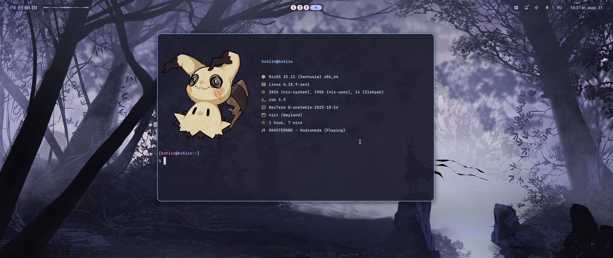

<div align="center">
	
	<h1>NixOS Niri</h1>
	<p>Конфиг NixOS на базе <b>niri</b>, <b>Noctalia</b>, <b>Home Manager</b> и переносимого <b>Python Installer</b>.</p>
	<a href="./README.md">
		
	</a>
	<a href="./README.en.md">
		
	</a>
</div>

***

<table align="right">
	<tr>
		<td colspan="2" align="center">Системные параметры</td>
	</tr>
	<tr>
		<th>Компонент</th>
		<th>Значение</th>
	</tr>
	<tr>
		<td>OS</td>
		<td>NixOS 25.11</td>
	</tr>
	<tr>
		<td>WM</td>
		<td>niri</td>
	</tr>
	<tr>
		<td>Shell</td>
		<td>zsh</td>
	</tr>
	<tr>
		<td>Terminal</td>
		<td>wezterm</td>
	</tr>
	<tr>
		<td>Panel</td>
		<td>Noctalia</td>
	</tr>
	<tr>
		<td>Browser</td>
		<td>Zen Browser</td>
	</tr>
	<tr>
		<td>File Manager</td>
		<td>Nautilus</td>
	</tr>
	<tr>
		<td>Editor</td>
		<td>Zed / Neovim</td>
	</tr>
	<tr>
		<td>Audio</td>
		<td>PipeWire</td>
	</tr>
	<tr>
		<td>Bootloader</td>
		<td>systemd-boot</td>
	</tr>
	<tr>
		<td>Theming</td>
		<td>Stylix</td>
	</tr>
	<tr>
		<td>Installer</td>
		<td>Python TUI</td>
	</tr>
</table>

<div align="left">
	<h3>📝 О проекте</h3>
	<p>
	Это переносимый конфиг <b>NixOS</b> для рабочего окружения на <b>niri</b> с интеграцией <b>Home Manager</b>, <b>Noctalia</b>, динамическими host-конфигами и встроенным Python-инсталлером.
	</p>
	<h3>🚀 Возможности</h3>
	<p>
	• Рабочее окружение на <b>niri</b> под Wayland<br>
	• Лаунчер, clipboard, wallpaper и session menu через <b>Noctalia</b><br>
	• Динамические flake-host'ы через <code>hosts/&lt;hostName&gt;</code><br>
	• Пошаговый Python installer для генерации host-конфига и live-установки<br>
	• Выбор GPU: <b>AMD</b>, <b>NVIDIA</b>, <b>Intel</b><br>
	• Поддержка <b>LUKS</b>, swap, отдельного <code>/home</code>, <b>btrfs</b> subvolumes<br>
	• Non-interactive режим для автоматизации установки<br>
	</p>
</div>

> [!WARNING]
> Live-режим инсталлера полностью стирает выбранный диск.
> Перед установкой обязательно проверь правильность диска, схемы разделов и параметров `LUKS` / `swap` / `/home`.
> Для другого ПК нужно пересоздавать `hardware-configuration.nix` под конкретное железо.

## 📦 Установка

### Интерактивный режим

```bash
python3 ./scripts/install.py
```

Installer теперь умеет presets:

- `desktop-amd`
- `desktop-nvidia`
- `desktop-intel`
- `server`
- `custom`

### Полная live-установка

```bash
sudo python3 ./scripts/install.py
```

### Пример non-interactive установки

```bash
sudo python3 ./scripts/install.py \
  --mode live \
  --host mypc \
  --user me \
  --role desktop \
  --timezone Europe/Kyiv \
  --locale ru_RU.UTF-8 \
  --gpu amd \
  --fs btrfs \
  --disk /dev/nvme0n1 \
  --swap-size-gib 8 \
  --yes
```

### Dry-run

```bash
sudo python3 ./scripts/install.py --mode live --host test --user me --gpu amd --fs btrfs --disk /dev/nvme0n1 --dry-run
```

### Export / import installer answers

```bash
python3 ./scripts/install.py --export-json install-profile.json
python3 ./scripts/install.py --import-json install-profile.json
```

### Что умеет installer

1. Создаёт новый host в `hosts/<hostName>`
2. Генерирует `meta.nix`
3. Размечает и форматирует диск в live-режиме
4. Настраивает `EFI + root`
5. Опционально создаёт `swap`
6. Опционально создаёт отдельный `/home`
7. Опционально включает `LUKS`
8. Создаёт `btrfs` subvolumes
9. Сохраняет `PARTUUID` / `UUID` для runtime storage-конфига
10. Делает backup существующего `hosts/<hostName>` перед перезаписью
11. Показывает план установки и проверяет необходимые утилиты до старта
12. Поддерживает presets и быстрый выбор timezone / locale через меню
13. Пишет лог установки в `.installer-logs/`
14. Умеет экспорт / импорт ответов в `json`
15. Делает cleanup mount / swap при ошибке установки

### Применение существующего host-конфига

```bash
sudo nixos-rebuild switch --flake .#<hostName>
```

## ⌨️ Реальные хоткеи

`Mod` — это клавиша `Super`.

| Действие | Комбинация |
| --- | --- |
| Открыть терминал | `Mod+Return` |
| Открыть / закрыть лаунчер | `Mod+A` |
| Открыть clipboard menu | `Mod+V` |
| Открыть / закрыть меню обоев | `Mod+W` |
| Открыть / закрыть session menu | `Mod+X` |
| Запустить Zen Browser | `Mod+Z` |
| Открыть Nautilus | `Mod+E` |
| Открыть Zed | `Mod+C` |
| Открыть Telegram | `Mod+T` |
| Закрыть окно | `Mod+Q` |
| Переключить floating mode | `Mod+Space` |
| Переключить overview | `Mod+O` |
| Развернуть колонку | `Mod+F` |
| Полный экран | `Mod+Shift+F` |
| Workspace 1..9 | `Mod+1..9` |
| Перенос в workspace 1..9 | `Mod+Shift+1..9` |
| Навигация по окнам/колонкам | `Mod+H / J / K / L` |
| Перемещение колонок/окон | `Mod+Ctrl+H / J / K / L` |
| Навигация по мониторам | `Mod+Shift+H / J / K / L` |
| Перенос колонки на монитор | `Mod+Shift+Ctrl+H / J / K / L` |
| Изменить ширину колонки | `Mod+=` / `Mod+-` |
| Изменить высоту окна | `Mod+Shift+=` / `Mod+Shift+-` |
| Скриншот | `Mod+Alt+Shift+4` |
| Overlay с хоткеями | `Mod+Shift+Slash` |
| Выключить мониторы | `Mod+Shift+P` |
| Выйти из `niri` | `Ctrl+Alt+Delete` / `Mod+Shift+E` |
| Scroll Lock helper | `Scroll_Lock` |

## 🗂️ Структура проекта

- `flake.nix` — flake entry и автоматическое обнаружение host'ов
- `lib/mkHost.nix` — сборка host-конфига из metadata
- `hosts/<hostName>` — host-specific файлы
- `modules/system` — системные модули
- `modules/home` — модули Home Manager
- `scripts/install.py` — точка входа installer'а
- `scripts/installer` — модульная реализация installer'а

## 📝 Примечания

- `meta.nix` хранит `hostName`, `userName`, `gpuType`, `role`, `timeZone`, `defaultLocale` и storage-метаданные
- runtime storage-логика расширяется через `modules/system/profiles/storage/default.nix`
- раскладка клавиатуры — `us,ru`, переключение через `Caps Lock`
